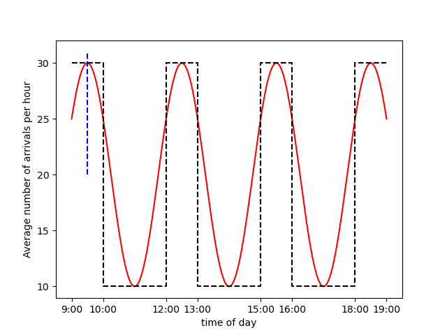

# Changing the arrival process II

Lets look again at this part of the problem statement:

> Customers do not arrive at a uniform rate during the day. There is usually a rush from 9:00-10:00, at lunch from 12:00-13:00, at around 15:00-16:00 and from 18:00-19:00 when folks leave work and head home. During these busy periods, the average rate of arrivals is approximately 30 customers per hour. In less busy times, the rate of arrivals is ten customers per hour.

You can include the information on the way the rate of customer arrivals changes throughout the day by using the piecewise function that was employed in the last exercise.  This function is indicated with a black dashed line on the following figure.

You can also use the function that is indicated with a red solid line in this figure.  When this function is used the rate of arrivals peaks in the middle of the busy hours and then decays and builds during the slow times.  Furthermore, the rate of arrivals changes continuously with time.

__Your task in this exercise is to modify the queuing tool code in `main.py` so that the the function shown as a red line above is used to determine the rate at each given time.__  Notice that the time that is passed as an argument to the `rate` function is in minutes and not hours as I have used in the axes of the figure above. Notice furthermore that the blue dashed line indicates that the first maximum in the function is at 9:30 in the morning.
